```{r setup, include=FALSE}
options(htmltools.dir.version = FALSE)
# see: https://github.com/yihui/xaringan
# install.packages("xaringan")
# see: 
# https://github.com/yihui/xaringan/wiki
# https://github.com/gnab/remark/wiki/Markdown
options(width=110)
options(digits = 4)
```

```{r, echo = FALSE}
knitr::opts_chunk$set(comment=NA, fig.width=6, fig.height=6, echo = TRUE, eval = TRUE, message = FALSE, warning = FALSE, fig.align = 'center')
```

```{r, echo = FALSE, message = FALSE, warning = FALSE}
library(tidyverse)
library(knitr)
```

## What is a dynamic report?

.pull-left45[

A dynamic report is a document that contains key elements which are automatically accessed and/or created by code:

- Access Data
- Wrangling / Statistics
- Plots
- Regular Text
- Formatting

]

.pull-right45[

### Example: 

<iframe src="http://rpubs.com/fabiorocha5150/decisiontreemodel" width="800" height="1000"></iframe>

]

---
## Why are dynamic reports important?

.pull-left45[

### 1. Efficiency

### 2. Reproducibility

### 3. Scaleability

]

.pull-right45[

```{r, echo = FALSE, out.width="100%", fig.align = 'center'}

```

]

---
## What are the benefits of dynamic reports?

.pull-left45[

- Data, code, analyses, and plots are all interconnected.

- The code *must* be correct because it is being run as the report is created.

- Anyone, even your future self, can replicate your analyses.

- If something changes in the data, the changes are automatically reflected in the results.

- If you get new data, you can easily create new analyses.

]

.pull-right45[

<iframe src="http://rpubs.com/fabiorocha5150/decisiontreemodel" width="800" height="1000"></iframe>

]


---
## What dynamic reports can I make in RStudio?

.pull-left45[

- Web (HTML) pages
   - Websites, blog posts, single documents to share
- PDF documents
- Slideshows (like this one)
- Shiny Apps
- Books
- R Packages

### How? Answer: R Markdown

]

.pull-right45[

```{r, echo = FALSE, out.width="100%", fig.align = 'center'}
knitr::include_graphics("../_image/RMarkdownOutputFormats.png")
```

]

---
## What is Markdown?

- Markdown is a simple, readible **markup language** that allows you to easily write text with special formatting **tags**, which are then converted to formatted outputs.

- **R Markdown** is a combination of Markdown and R code.

```{r, echo = FALSE, out.width="50%", fig.align = 'center'}
knitr::include_graphics("../_image/markdown_ss.png")
```

---
## Cheatsheet

```{r, echo = FALSE, out.width="55%", fig.align = 'center'}
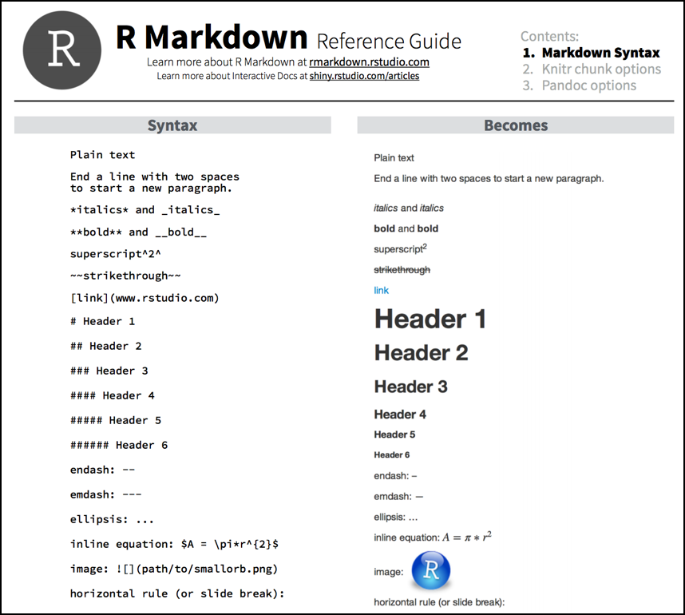
```

Source: https://www.rstudio.com/wp-content/uploads/2015/03/rmarkdown-reference.pdf

---
## How do I write an R Markdown Document

```{r, echo = FALSE, out.width="80%", fig.align = 'center'}
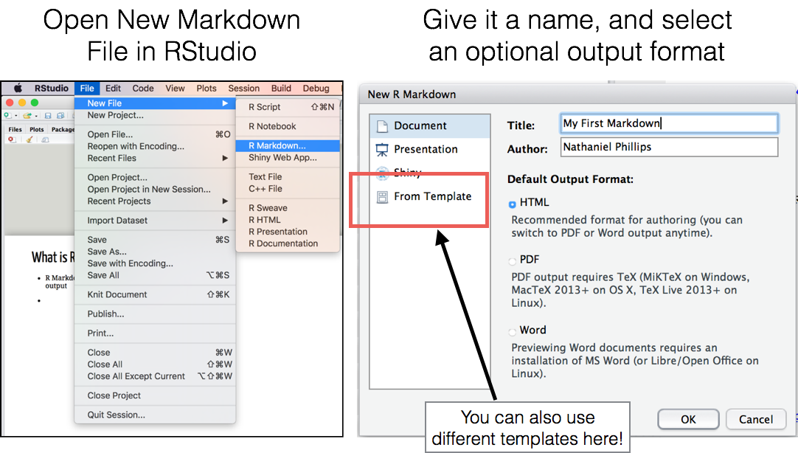
```

---
## R Markdown = Markdown + R code

```{r, echo = FALSE, out.width="45%", fig.align = 'center'}
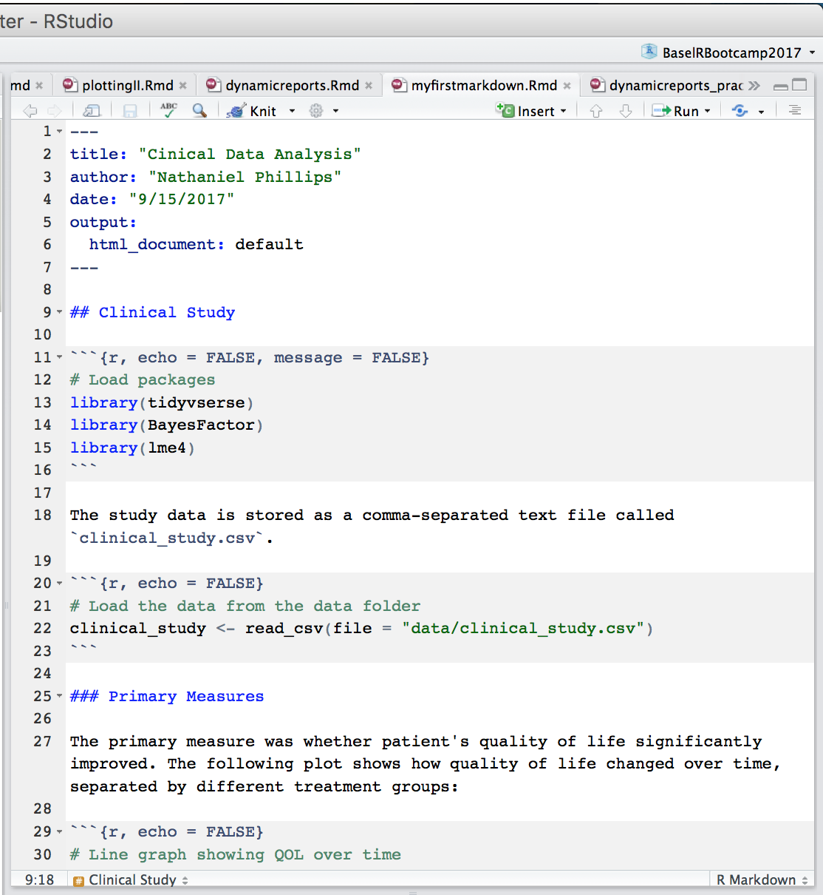
```

---
## R Markdown = Markdown + R code

```{r, echo = FALSE, out.width="70%", fig.align = 'center'}
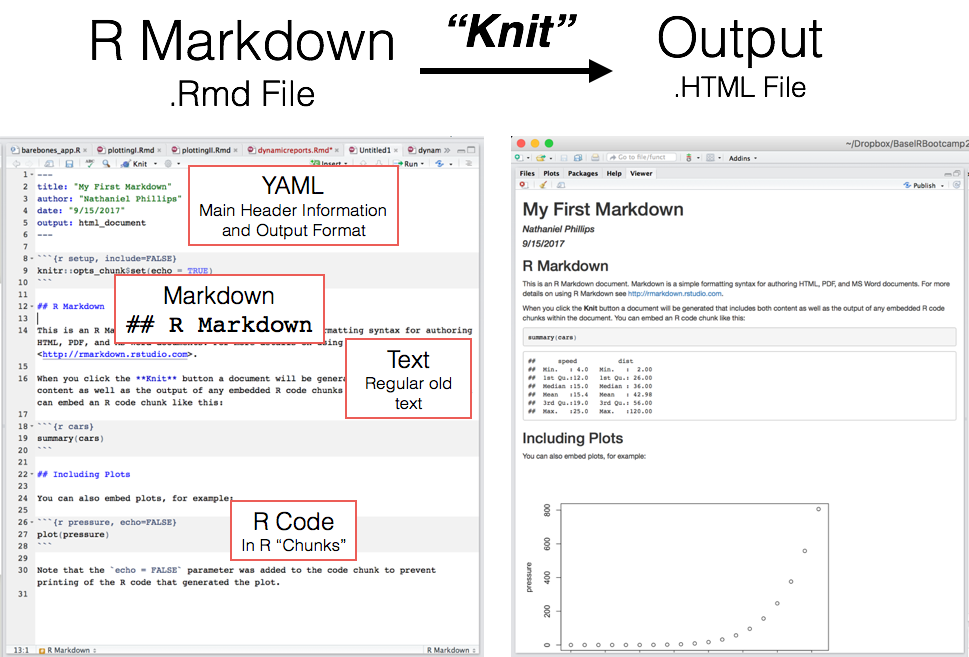
```

---
## R Markdown = Markdown + R code

```{r, echo = FALSE, out.width="70%", fig.align = 'center'}
knitr::include_graphics("../_image/knitto.png")
```

---
## R Markdown Applications

http://rmarkdown.rstudio.com/gallery.html

<iframe src="http://rmarkdown.rstudio.com/gallery.html" width="800" height="800"></iframe>

---
## R Chunks in R Markdown

```{r, echo = FALSE, out.width="60%", fig.align = 'center'}
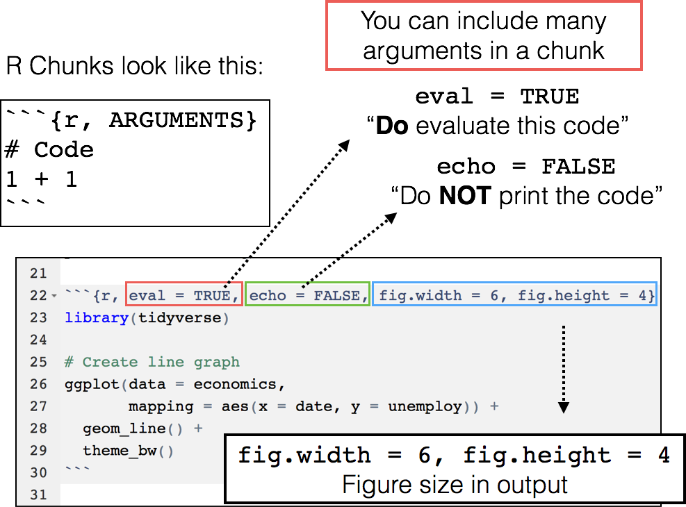
```

---
## R Chunks in R Markdown

- You can set default chunk options with `ops_chunk$set()`. When you do, all future chunks will have these settings (unless you specify otherwise)

```{r, echo = TRUE, eval = FALSE}
# Example: Set default values for ALL future chunks
#   with knitr::ops_chunk$set


knitr::opts_chunk$set(fig.width = 6,        # Figure width (in)
                      fig.height = 6,       # Figure height (in)
                      echo = TRUE,          # Repeat code
                      eval = TRUE,          # Evaluate chunks
                      message = FALSE,      # Don't print messages
                      warning = FALSE,      # Don't print warnings
                      fig.align = 'center') # Center figures
```

- We recommend setting chunk options at the beginning of each document!

---
## Inline chunks

- You can also include *inline chunks* where R code is included in a sentence. This allows you to include R output in your text!

<br>
<br>

```{r, echo = FALSE, fig.cap = "", out.width = "70%"}
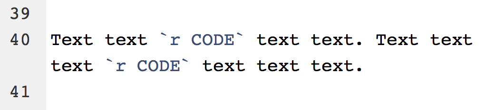
```

---
## Inline chunks

```{r, echo = FALSE, out.width = "100%"}
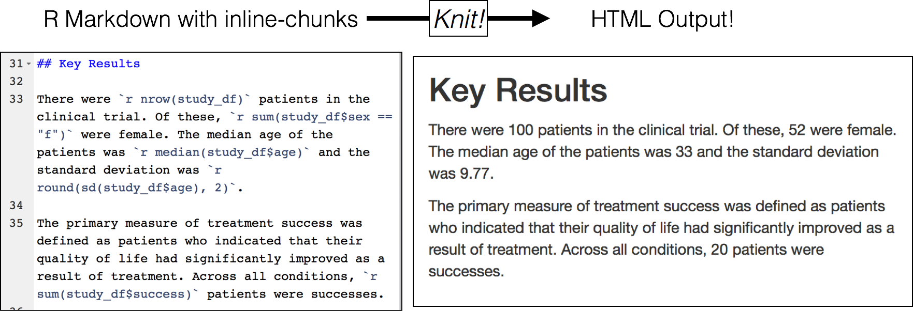
```

---
## Key points in R Markdown

.pull-left45[

<br>
<br>

1. You can easily read in external files like images, R code, or datasets. 

2. All external files should be in a folder in the "Root" Directory containing the Markdown (.Rmd) file

3. All data necessary for your report *must* be explicitly read into the document. So keep them close by!

]

.pull-right45[

#### Here is the "Root" directory of the R Markdown file `dynamicreports.Rmd` that created *this* presentation

```{r, echo = FALSE, out.width="100%", fig.align = 'center'}
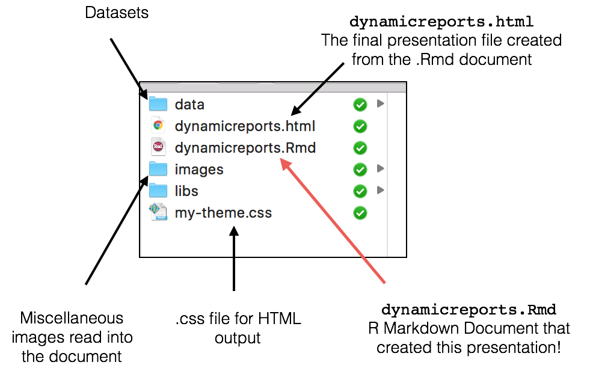
```

]

---
## Rendering output with `knitr`

.pull-left45[

```{r, out.width = "30%", echo = FALSE}
knitr::include_graphics("../_image/knitr_hex.png")
```

- To render output like images and tables into R Markdown, use the `knitr` package.

- The two most useful `knitr` functions are `include_graphics()` and `kable()`

| Function|Output|
|:------|:----|
|     `include_graphics(path)`| Include an external image (e.g.; .png, .jpg)|
|     `kable(df, format)`|Include a dataframe as a table|

]

.pull-right45[

### Print a dataframe as a table with `kable()`

```{r, echo = TRUE, eval = TRUE, results = 'asis'}
kable(economics[1:3, c("date", "pop")], 
      format = 'markdown')
```

### Include an image

```{r, echo = TRUE, out.width = "20%"}
include_graphics(path = "../_image/rlogo.png")
```

]

---
## Key points in R Markdown

.pull-left3[

<br>
<br>

1. When you "Knit" an R markdown document, it will start with an *empty* workspace (ie. it will forget everything!)

2. You must explicitly load all packages with `library()` and load in external datasets (e.g.; `clinical_data <- read_csv("data/data.csv")`)

3. If you have any typos, errors, or missing code, the document will *not* knit (this is a *good* thing!)

]

.pull-right6[

#### Well formatted R Markdown document

```{r, echo = FALSE, out.width="100%", fig.align = 'center'}
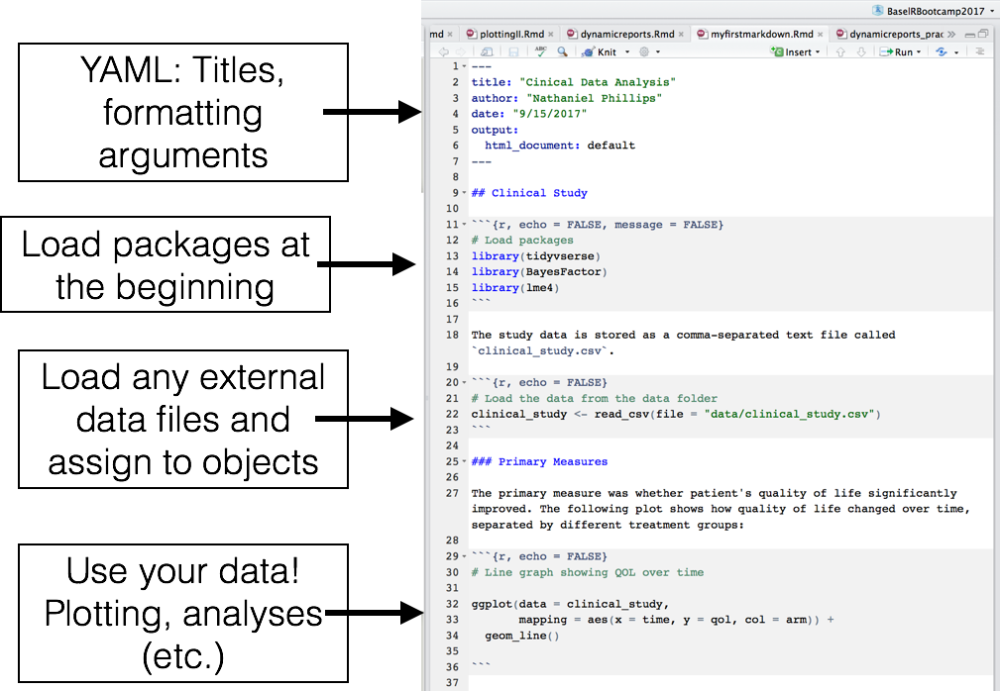
```

]

---
## Output types

.pull-left4[

- There are *many* different output formats you can create from an R Markdown document

- Many come with RStudio, many are distributed in packages:

| Package|Description|
|:------|:----|
|     `xaringan`*| Slideshows (like this one!)|
|     `papaja`*|APA Manuscripts|
|     `rmdformats`|Many templates|
|     `prettydoc`|Many templates|

* = On GitHub

]

.pull-right55[

### R Markdown templates in R Studio

```{r, echo = FALSE, out.width="100%", fig.align = 'center'}
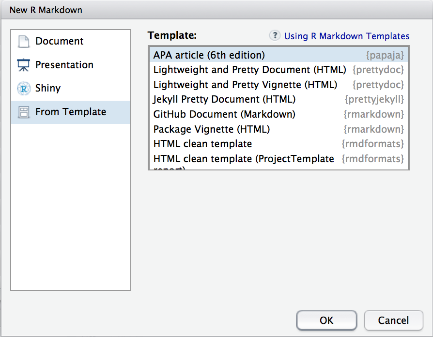
```

]

---
## To write to PDF, you need TeX

.pull-left3[

In order to knit your document to a PDF, you'll need a TeX installation

]

.pull-right65[

```{r, echo = FALSE, out.width="70%", fig.align = 'center'}
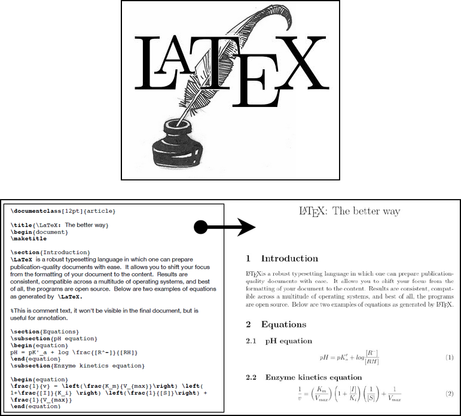
```

]

---
## Why are RMarkdown documents so great?

.pull-left45[

<br>
<br>

1. The data, code, and output are all in the same place.

2. Everything works and is replicable! (If it wasn't, the document wouldn't *Knit*!)

3. You can produce great looking documents, from simple PDFs, to webpages, to presentations (like this one), to books.

]

.pull-right45[

```{r, echo = FALSE, out.width="100%", fig.align = 'center'}
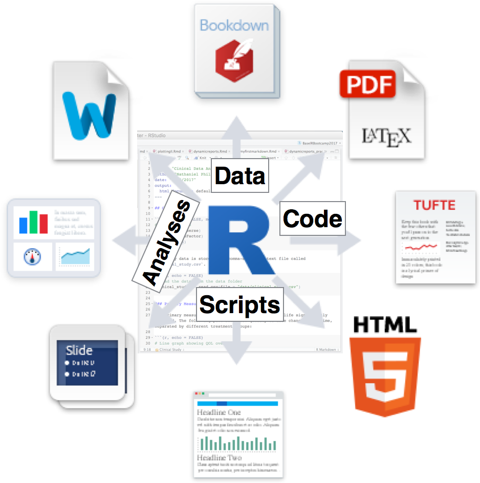
```

]

---
## R Packages - The ultimate dynamic report?

.pull-left45[

If you want a fully contained, dynamic report that contains data, code, statistics, plots, text, help files and documentation that you can easily share, your answer may be creating an **R Package**.

#### Installing an example package from GitHub

```{r, eval = FALSE}
# Install cStudy2017 from github
install_github("bootcamp/cStudy2017")

# Load cStudy2017 package
library("cStudy2017")

# Open cStudy2017 package help
?cStudy2017

# Oh study1_A contains study 1...
ggplot(data = study1_A, 
       ...)

FFTrees(success ~ .,
        data = study1_A)
```

]

.pull-right45[

### Folder structure for a simple package

```{r, echo = FALSE, out.width="100%", fig.align = 'center'}
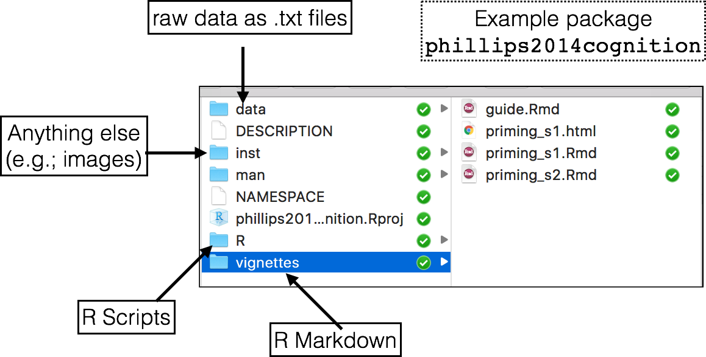
```

<br>

Read Wickham's book **"R Packages"** (also available for free online) to learn how to write your own package

]

---
## Practical

- Goal: Create a basic, dynamic report that returns an HTML (or PDF) document as a report, and another that returns a presentation!


